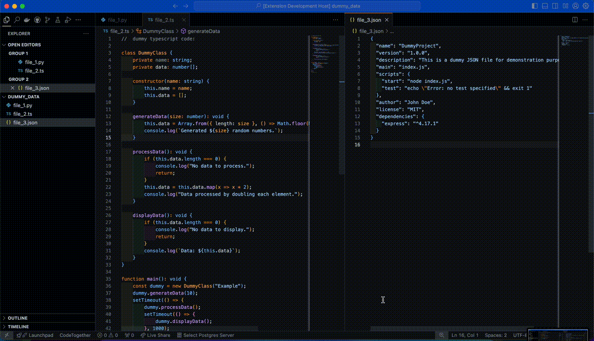

## Description

[`vscode2prompt`](https://marketplace.visualstudio.com/items?itemName=farzan-tinati.vscode2prompt "Go to definition") is a Visual Studio Code extension that allows you to merge selected files or open tabs into a single file. This is particularly useful for preparing content to be used in chat applications like ChatGPT.
inspired by [code2prompt](https://github.com/mufeedvh/code2prompt)

## Features

- **Merge Selected Files**: Select multiple files from your workspace and merge their contents into a single virtual document.
- **Merge Open Tabs**: Merge the contents of all open text tabs into a single virtual document.




## Installation

1. Clone the repository or download the extension package.
2. Open the project in Visual Studio Code.
3. Run `npm install` to install the dependencies.
4. Press `F5` to open a new VS Code window with the extension loaded.

## Usage

### Merge Selected Files

1. Open the Command Palette (`Ctrl+Shift+P` or `Cmd+Shift+P` on macOS).
2. Type `Merge Selected Files` and select the command.
3. Choose the files you want to merge from the quick pick list.
4. A new tab will open with the merged content.

### Merge Open Tabs

1. Open the Command Palette (`Ctrl+Shift+P` or `Cmd+Shift+P` on macOS).
2. Type `Merge Open Tabs` and select the command.
3. A new tab will open with the merged content of all open text tabs.

## Commands

The extension contributes the following commands:

- `extension.mergeSelectedFiles`: Merge selected files from the workspace.
- `extension.mergeOpenTabs`: Merge the contents of all open text tabs.

## Development

### Build

To build the extension, run:

```sh
npm run compile
```

### Watch

To watch for changes and automatically compile, run:

```sh
npm run watch
```

### Test

To run the tests, execute:

```sh
npm test
```

## Contributing

Contributions are welcome! Please open an issue or submit a pull request.

## License

This project is licensed under the MIT License. See the LICENSE file for details.

## Acknowledgements

Special thanks to the VS Code team for their excellent API and documentation.

---

For more information, visit the [Visual Studio Code documentation](https://code.visualstudio.com/docs).

---